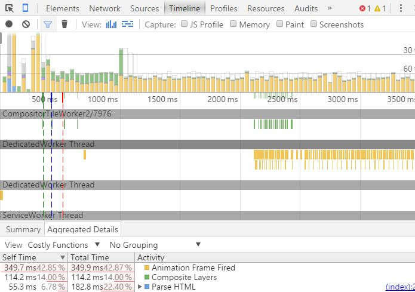

# A Snappier QR Code App
Udacity [Browser Rendering Optimization](https://www.udacity.com/course/browser-rendering-optimization--ud860) Course Work

## Requirements
* Refactor the QR Code App by replacing `setInterval` with `requestAnimationFrame`. When the app loads, you must see animation frame firing in the timeline.
* Refactor image decoding with a web worker
* Build and run using `gulp serve`

## Steps taken

Installed software
* Cloned the [QR Code App repository](https://github.com/udacity/qrcode)
* Installed the latest Windows version of [npm](https://github.com/npm/npm) (node-v4.2.1-x64.msi on 10/21/2015)
* Installed [gulp](https://github.com/gulpjs/gulp/blob/master/docs/getting-started.md) globally
* Ran `npm install` in the QR Code App directory

Got an error that an old version of node-gyp is installed. To update node-gyp, I ran cmd as Admin, then:
```
cd "C:\Program Files\nodejs\node_modules\npm"
npm install node-gyp@latest
CD /D D:\GitHub\qrcode\app
npm install
```

Different node-gyp error this time:
>MSBUILD : error MSB3428: Could not load the Visual C++ component "VCBuild.exe". To fix this, 1) install the .NET Framework 2.0 SDK, 2) install Microsoft Visual Studio 2005 or 3) add the location of the component to the system path if it is installed elsewhere.**

I was not inclined to install an antique version of .NET Framework and Visual Studio on my laptop. A post [here](https://github.com/npm/npm/issues/8169) was very helpful:
>First ensure that you have the latest version of node-gyp installed, expecting that this version would also have the reference to the latest version of the Visual Studio.

Sounds like a plan.
* Downloaded [Microsoft Visual Studio Community 2015](https://www.visualstudio.com/downloads/download-visual-studio-vs), installing C++ and Web Development
* Added user environment variables (Control Panel|System|Advanced System Settings|Environment Variables)
  ```
  GYP_MSVS_VERSION=2015
  VCTargetsPath=C:\Program Files (x86)\MSBuild\Microsoft.Cpp\v4.0\V140
  ```
* Opened cmd as Admin
  ```
  npm config set msvs_version 2015 --global
  ```
* Updated node (v4.2.1) and npm (v2.14.7) ([details](https://docs.npmjs.com/getting-started/installing-node))
* Updated gulp ([details](https://www.npmjs.com/package/gulp-update))
    ```
    npm install gulp-update
    ```
* Updated node-sass
  ```
  npm install node-sass
  ```

Got this error:
>Can not download file from https://raw.githubusercontent.com/sass/node-sass-binaries/v2.1.1/win32-x64-node-4.0/binding.node

Followed the solution posted [here](http://devquestion.tk/32552499/error-running-gulp-sass.html)
* Some clean-up first
  ```
  CD /D D:\GitHub\qrcode\app
  RD ..\node_modules /s
  ```
* Opened package.json, changed gulp-sass version to 2.0.4
* Fixed node-sass
  ```
  npm install node-sass@3.3.3
  npm -g install node-gyp@3
  npm uninstall gulp-sass
  npm install gulp-sass@2
  npm rebuild node-sass
  ```
  
Gave it another try 
```
npm install
```

Success!  Now to build and run before making any JavaScript changes 
```
gulp serve
```

Also a success.  Next step was to modify the scripts.  This was a 2-part quiz but I'll just summarize the steps taken for both parts:
* app\scripts\main.js 
  - changed `setInterval` to `requestAnimationFrame` in the captureFrame() function
  - created a web worker in the QRCodeManager() function
* app\index.html - removed '<script>' tags of the scripts moved to the web worker

## Testing the app
* Open cmd as Admin
  ```
  CD /D D:\GitHub\qrcode\app
  gulp serve
  ```
* In Chrome, press F12 to open DevTools
* Click on the Timeline tab
* Enable Frames view and Flame Chart view
* Press CTRL-R to record a timeline
* In the Flame Chart view, scroll down and you'll see there are Worker Threads
* Click on Aggregated Details tab to verify that *Animation Frame Fired* is in the Activity list


